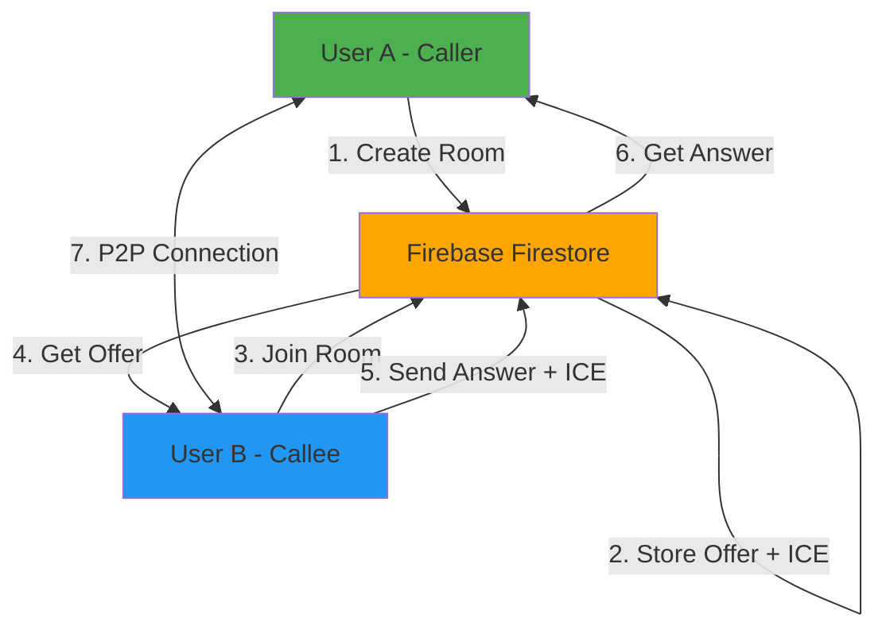
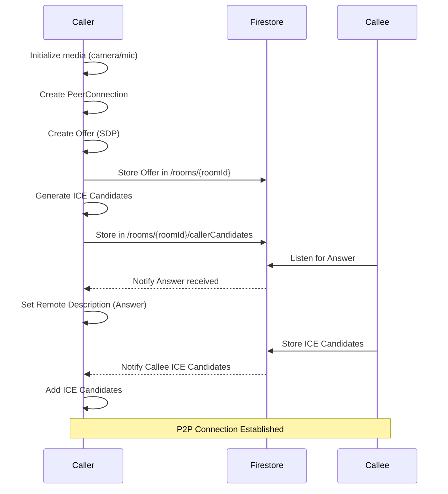
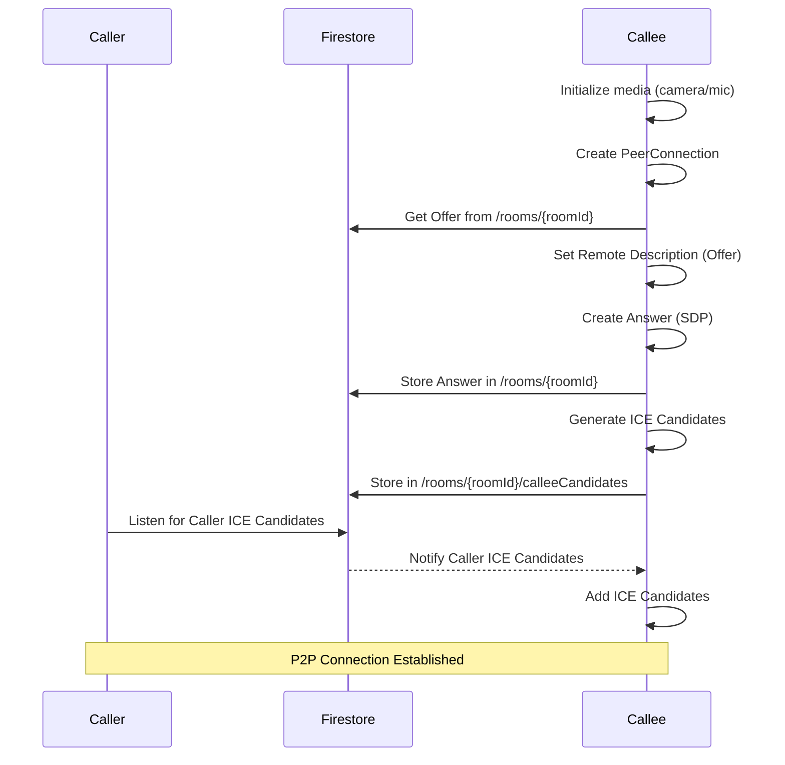
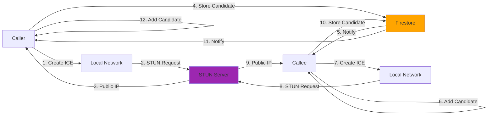

# Flutter WebRTC Video Call App

A peer-to-peer video calling application built with Flutter and WebRTC, using Firebase Firestore for signaling.

## Features

- Real-time peer-to-peer video and audio calls
- Firebase Firestore-based signaling
- Room-based connection system (create/join rooms)
- Camera switching (front/back)
- Audio/Video toggle controls
- Cross-platform support (Android, iOS, Web, macOS, Windows)

## Architecture Overview



## Prerequisites

Before you begin, ensure you have the following installed:

- **Flutter SDK**: >= 3.7.0 ([Installation Guide](https://flutter.dev/docs/get-started/install))
- **Dart SDK**: Comes with Flutter
- **Firebase Account**: [Create one here](https://firebase.google.com/)
- **IDE**: VS Code, Android Studio, or IntelliJ IDEA
- **Git**: For version control

### Platform-Specific Requirements

#### Android
- Android Studio
- Android SDK (API level 21+)
- Android device or emulator with camera and microphone

#### iOS/macOS
- Xcode 14.0+
- CocoaPods
- Physical iOS device (simulator doesn't support camera)

#### Web
- Chrome, Firefox, Safari, or Edge browser with WebRTC support

## Firebase Configuration

### Step 1: Create Firebase Project

1. Go to [Firebase Console](https://console.firebase.google.com/)
2. Click "Add Project" or select an existing project
3. Enter project name and follow the setup wizard
4. Enable Google Analytics (optional)

### Step 2: Enable Firestore Database

1. In Firebase Console, navigate to **Firestore Database**
2. Click "Create Database"
3. Choose **Start in test mode** for development
4. Select your Cloud Firestore location
5. Click "Enable"

### Step 3: Add Firebase to Your App

#### Using FlutterFire CLI (Recommended)

```bash
# Install FlutterFire CLI
dart pub global activate flutterfire_cli

# Configure Firebase for all platforms
flutterfire configure
```

Follow the prompts:
- Select your Firebase project
- Choose platforms (android, ios, macos, web, windows)
- This will generate `lib/firebase_options.dart` and platform-specific config files

#### Manual Configuration (Alternative)

<details>
<summary>Click to expand manual setup instructions</summary>

##### Android
1. Download `google-services.json` from Firebase Console
2. Place it in `android/app/src/google-services.json`

##### iOS
1. Download `GoogleService-Info.plist` from Firebase Console
2. Add it to `ios/Runner/GoogleService-Info.plist` using Xcode

##### macOS
1. Download `GoogleService-Info.plist` for macOS
2. Add it to `macos/Runner/GoogleService-Info.plist`

##### Web
1. Register your web app in Firebase Console
2. Copy the Firebase config
3. Create `lib/firebase_options.dart` with your config

</details>

### Step 4: Firestore Security Rules (Development)

For testing purposes, use these rules (⚠️ **NOT for production**):

```javascript
rules_version = '2';
service cloud.firestore {
  match /databases/{database}/documents {
    match /rooms/{roomId} {
      allow read, write: if true;
      match /callerCandidates/{candidateId} {
        allow read, write: if true;
      }
      match /calleeCandidates/{candidateId} {
        allow read, write: if true;
      }
    }
  }
}
```

## Installation

### 1. Clone the Repository

```bash
git clone https://github.com/webby813/flutter_web_rtc.git
cd flutter_web_rtc
```

### 2. Install Dependencies

```bash
flutter pub get
```

### 3. Configure Firebase

Run the FlutterFire CLI:

```bash
flutterfire configure
```

**Important**: Add the generated files to `.gitignore`:
- `android/app/src/google-services.json`
- `ios/Runner/GoogleService-Info.plist`
- `macos/Runner/GoogleService-Info.plist`
- `lib/firebase_options.dart`

These files contain sensitive API keys and should **never** be committed to version control.

### 4. Platform-Specific Setup

#### iOS Setup
```bash
cd ios
pod install
cd ..
```

#### macOS Setup
```bash
cd macos
pod install
cd ..
```

### 5. Run the App

```bash
# Run on connected device/emulator
flutter run

# Run on specific device
flutter run -d <device_id>

# List available devices
flutter devices
```

## Usage

### Starting a Video Call

#### As Caller (Create Room)

1. Launch the app
2. Click **"Create Room"** button
3. Allow camera and microphone permissions when prompted
4. A **Room ID** will be generated and displayed
5. Share this Room ID with the person you want to call
6. Wait for them to join

#### As Callee (Join Room)

1. Launch the app
2. Enter the **Room ID** provided by the caller
3. Click **"Join Room"** button
4. Allow camera and microphone permissions
5. Connection will be established automatically

### During Call

- **Mute/Unmute**: Tap the microphone icon
- **Video On/Off**: Tap the camera icon
- **Switch Camera**: Tap the flip camera icon (mobile only)
- **Hang Up**: Tap the red phone icon

## WebRTC Call Flow

### Caller Flow (Create Offer)



### Callee Flow (Join Room)



### ICE Candidate Exchange



## Project Structure

```
flutter_web_rtc/
├── lib/
│   ├── main.dart                    # App entry point
│   ├── firebase_options.dart        # Firebase config (auto-generated)
│   ├── screens/
│   │   ├── video_call_screen.dart   # Main video call UI
│   │   └── firestore_test_screen.dart
│   └── services/
│       └── webrtc_service.dart      # WebRTC logic & signaling
├── android/                         # Android-specific code
├── ios/                            # iOS-specific code
├── macos/                          # macOS-specific code
├── web/                            # Web-specific code
├── windows/                        # Windows-specific code
├── pubspec.yaml                    # Dependencies
├── firebase.json                   # Firebase CLI config
└── README.md                       # This file
```

## Key Technologies

| Technology | Purpose |
|------------|---------|
| **flutter_webrtc** | WebRTC implementation for Flutter |
| **Firebase Firestore** | Signaling server for exchanging SDP/ICE |
| **firebase_core** | Firebase initialization |
| **STUN Servers** | NAT traversal (Google STUN servers) |

## Troubleshooting

### Camera/Microphone Not Working

- **Permissions**: Ensure camera and microphone permissions are granted
- **Android**: Check `AndroidManifest.xml` for permissions
- **iOS/macOS**: Check `Info.plist` for usage descriptions
- **Web**: Browser must support WebRTC and have permissions enabled

### Connection Failed

1. **Check Firestore Rules**: Ensure read/write permissions are enabled
2. **Check Network**: Both peers must have internet connectivity
3. **Check STUN/TURN**: Google STUN servers might be blocked in some regions
4. **Console Logs**: Check for error messages in debug console

### ICE Connection Timeout

- Firewall or corporate network may block WebRTC traffic
- Consider adding TURN servers for NAT traversal:

```dart
'iceServers': [
  {'urls': 'stun:stun.l.google.com:19302'},
  {
    'urls': 'turn:your-turn-server.com:3478',
    'username': 'username',
    'credential': 'password'
  }
]
```

### Firebase Configuration Issues

```bash
# Reconfigure Firebase
flutterfire configure

# Check if firebase_options.dart exists
ls lib/firebase_options.dart

# Verify Firebase initialization in main.dart
```

## Security Considerations

⚠️ **Important**: Before deploying to production:

1. **Firestore Security Rules**: Implement proper authentication and authorization
2. **API Keys**: Never commit Firebase config files to public repositories
3. **TURN Servers**: For production, use authenticated TURN servers
4. **User Authentication**: Implement Firebase Authentication
5. **Rate Limiting**: Prevent abuse of room creation

## Contributing

Contributions are welcome! Please follow these steps:

1. Fork the repository
2. Create a feature branch: `git checkout -b feature/your-feature`
3. Commit your changes: `git commit -m 'Add some feature'`
4. Push to the branch: `git push origin feature/your-feature`
5. Open a Pull Request

## License

This project is open source and available under the [MIT License](LICENSE).

## Resources

- [Flutter WebRTC Documentation](https://pub.dev/packages/flutter_webrtc)
- [Firebase Documentation](https://firebase.google.com/docs)
- [WebRTC API Reference](https://developer.mozilla.org/en-US/docs/Web/API/WebRTC_API)
- [FlutterFire Documentation](https://firebase.flutter.dev/)

## Contact

For questions or issues, please open an issue on GitHub or contact the maintainer.

---

Made with ❤️ using Flutter and WebRTC
